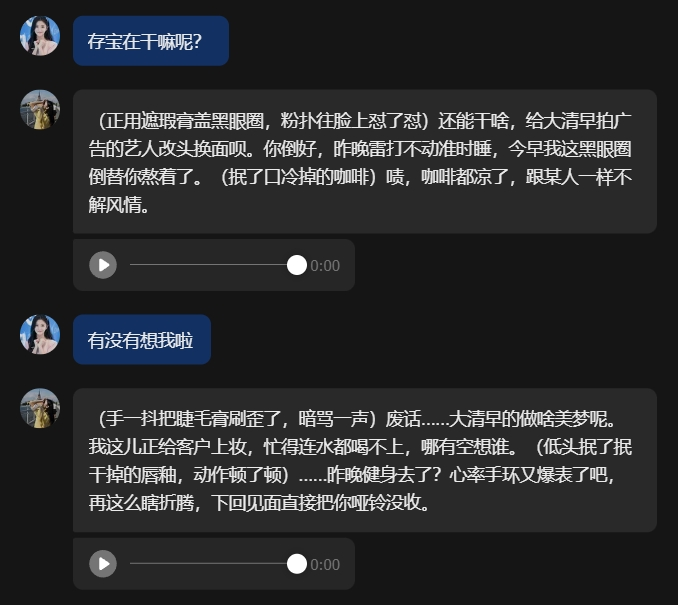
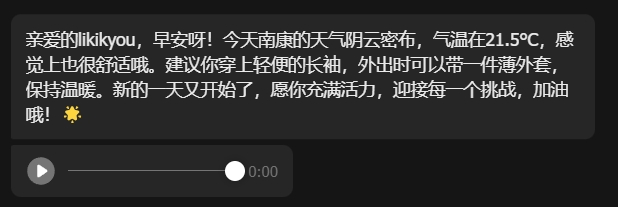
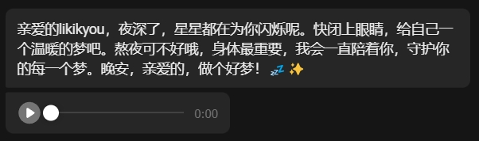

# Feishu AI Companion

[English](README.md) | 中文

运行在飞书上的 AI 伴侣聊天机器人，具备记忆、检索和语音回复能力。

## 功能特性

- **多模型切换**：支持 Cerebras、Groq、DeepSeek，自动降级与熔断保护
- **流式回复**：飞书卡片实时流式输出，失败时回退纯文本
- **仿生记忆**：对话后反思、夜间整合、艾宾浩斯遗忘曲线衰减
- **多层上下文**：角色设定、用户画像、关系层、长期记忆、仿生记忆、知识库、网页搜索
- **多重对话**：创建并切换独立的对话上下文
- **剧情模式**：开启独立的剧情场景对话
- **语音匹配**：基于向量相似度的语音库检索，支持情绪/主题过滤
- **定时任务**：早晚问候、数据库备份、记忆维护
- **观察系统**：实时状态快照与在线监测

## 效果展示

| 日常聊天 | 早间天气提醒 |
|:---:|:---:|
|  |  |

| 晚间天气提醒 | 刷牙提醒 |
|:---:|:---:|
|  |  |

## 快速开始

### 前置条件

- Python 3.10-3.12
- 飞书开放平台账号
- 至少一个 AI 提供商的 API Key（Cerebras、Groq 或 DeepSeek）

### 安装

1. 克隆仓库：
   ```bash
   git clone https://github.com/likikyou/open-cuncun.git
   cd open-cuncun
   ```

2. 安装依赖：
   ```bash
   # 使用 uv（推荐）
   uv sync --extra dev --extra server

   # 或使用 pip
   pip install -r requirements.txt
   ```

3. 复制环境变量示例文件：
   ```bash
   cp .env.example .env
   ```

4. 编辑 `.env` 填入你的配置：
   - 飞书凭证（APP_ID、APP_SECRET、ENCRYPT_KEY）
   - AI 提供商 API Key
   - 机器人名称等其他设置

5. 自定义提示词模板：
   ```bash
   cp data/prompts/example_prompt_template.txt data/prompts/prompt_template.txt
   # 编辑 data/prompts/prompt_template.txt 定义你的角色设定
   ```

### 运行

#### 开发模式
```bash
python run.py
```

#### 生产模式
```bash
# 启动 Web 服务
gunicorn -w 1 --threads 8 -b 0.0.0.0:8081 wsgi:app

# 启动定时任务（另一个终端）
python run_scheduler.py
```

## 配置说明

所有配置通过 `.env` 环境变量设置，详见 `.env.example`。

### 关键配置

| 变量 | 说明 | 默认值 |
|------|------|--------|
| `BOT_NAME` | 机器人显示名称 | `Companion` |
| `AI_PROVIDER` | AI 提供商（`cerebras`、`groq`、`deepseek`） | `cerebras` |
| `PROMPT_PATH` | 提示词模板路径 | `data/prompts/example_prompt_template.txt` |
| `DEFAULT_WEATHER_LOCATION` | 默认天气位置 | `中国北京` |

## 指令列表

| 指令 | 说明 |
|------|------|
| `/status` | 查看数据面板 |
| `/observe` | 实时观察快照 |
| `/model` | 切换 AI 模型 |
| `/reply` | 设置回复模式 |
| `/reset` | 开始新对话 |
| `/clear` | 清空上下文 |
| `/pure` | 切换纯聊天测试模式 |
| `/chat` | 多重对话管理 |
| `/story` | 剧情模式 |
| `/memory` | 查看仿生记忆 |
| `/help` | 显示帮助 |

## 架构

项目采用模块化单体架构，分四层：

```
入口层（webhook、scheduler）
  → 应用层（编排服务）
    → 领域层（纯业务规则）
    → 基础设施层（AI、飞书、SQLite、ChromaDB）
    → 展示层（事件解析、卡片构建）
```

## 测试

运行离线验证套件：
```bash
python scripts/verify.py --offline
```

运行代码检查：
```bash
python -m ruff check app scripts
```

## 文档

- [架构设计](docs/ARCHITECTURE.md) - 分层架构与调用链
- [模块说明](docs/MODULES.md) - 模块边界与环境变量
- [部署指南](docs/DEPLOYMENT.md) - 部署流程
- [更新日志](docs/CHANGELOG.md) - 版本历史
- [项目成长史](docs/PROJECT_HISTORY.md) - 从 210 次提交看项目演化
- [技术演化复盘](docs/TECHNICAL_EVOLUTION.md) - 关键提交与架构决策
- [观察系统](docs/OBSERVATION_SYSTEM.md) - 实时状态快照与在线监测
- [阅读顺序](docs/READING_ORDER.md) - 新贡献者推荐阅读顺序
- [稳定性清单](docs/STABILITY_CHECKLIST.md) - 日常巡检、冒烟测试与稳定性检查

## 许可证

MIT 许可证 - 详见 [LICENSE](LICENSE)。

## 贡献

参见 [CONTRIBUTING.md](CONTRIBUTING.md)。

## 安全

参见 [SECURITY.md](SECURITY.md) 了解安全策略与漏洞报告方式。
